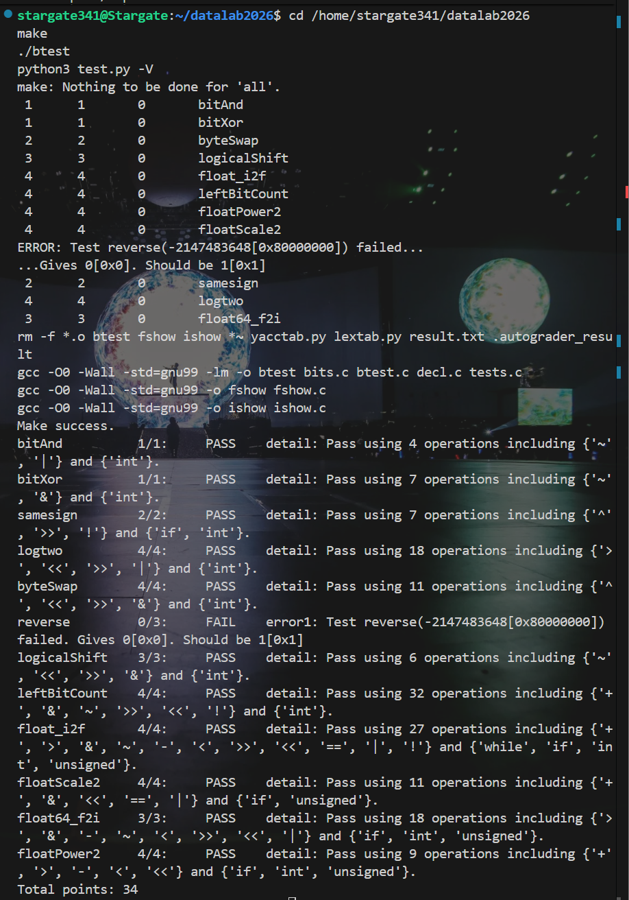

# datalab 报告

姓名：盛蕴涵  
学号：2025201896

## 测试结果

总分：34

## 解题报告

### bitAnd

将 `x & y` 转换为 `~(~x | ~y)`。

### bitXor

分别排除两个位同时为 1 和同时为 0 的情况，从而得到异或结果。

### samesign

先单独处理 0，再提取两个整数的符号位，通过异或判断符号是否相同。

### logtwo

正整数的二进制对数等于最高有效位的位置。依次判断最高位是否达到 16、8、4、2、1，实现二分查找。

### byteSwap

先取出两个目标字节，再利用异或得到它们的差异，将差异异或回原位置完成交换。

### reverse

采用分治方法，依次交换相邻位、2 位块、4 位块、字节和高低 16 位。

### logicalShift

先进行算术右移，再构造掩码，将负数右移后高位补入的 1 清零。

### leftBitCount

依次判断最高 16、8、4、2、1 位是否全部为 1，并累加连续 1 的数量。

### float_i2f

先取得符号和绝对值，再根据最高有效位计算指数。有效位超过 24 位时，按照向最近偶数舍入的规则处理。

### floatScale2

根据指数分类处理：NaN 和无穷保持不变，非规格化数左移，普通数指数加 1，溢出时返回无穷大。

### float64_f2i

从双精度位表示中取出符号、指数和尾数，根据真实指数移动尾数，得到整数部分，最后处理符号和溢出。

### floatPower2

按照 `-149`、`-126` 和 `127` 三个边界，分别返回 0、非规格化数、规格化数或正无穷。

## 总结

通过本次实验，我加深了对补码、位运算和 IEEE 754 浮点数表示的理解，也学习了使用二分和分治方法减少操作次数。

## 参考资料

1. DataLab README 和函数注释。
2. 课程中关于位运算和浮点数表示的讲义。